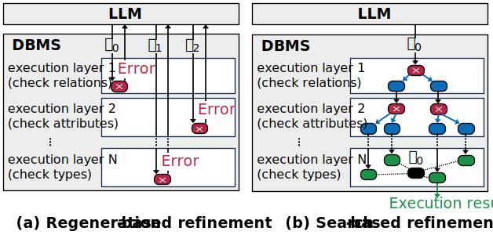

<div align="center">

# 🔍 SafeQL  
### **Search-based Refinement for Trustworthy and Efficient Text-to-SQL**

</div>

---

## 📘 What is SafeQL?

SafeQL is a DBMS-integrated **refinement framework** that achieves efficient and reliable SQL correction through a **search-based refinement paradigm**

---

## 🎯 Search-based Refinement

<p align="center">

</p>

### 🔸 (a) Regeneration-based refinement  
Traditional Text-to-SQL systems follow a regeneration loop: the model generates an initial query $q_0$, the DBMS executes it, the query fails, and the system discards it entirely before producing a new query $q_1$ using the error message. This process repeats—
$q_2, q_3, ... $—until some executable query eventually appears. Because every iteration rebuilds the whole query, valid fragments are repeatedly thrown away, leading to redundant work and unstable convergence.

### 🔹 (b) Search-based refinement (*Ours*)
SafeQL takes a fundamentally different approach. When $q_0$ fails, it keeps the original structure intact and uses DBMS feedback to pinpoint the exact faulty component—whether a relation, attribute, function, or value. It then applies a minimal, structure-preserving correction, producing refined queries that reuse all valid parts of the original input. Through this process, SafeQL replaces the traditional trial-and-error regeneration loop with a guided search over a safe query space in which all candidates remain syntactically sound and semantically grounded. Among the possible refinements, it chooses the one that remains closest in meaning to the user’s original intent.

👉 Full details are in the paper.

---

## 🚀 Quick Start

Below is a complete end-to-end example for new users.
You can run SafeQL instantly using a Docker image that bundles PostgreSQL, pgvecto.rs, and SafeQL.

### 1️⃣ Start SafeQL (Docker)
For new users, we recommend launching the environment via Docker:

```bash
docker run \
  --name safeql-demo \
  -e POSTGRES_PASSWORD=mysecretpassword \
  -p 5432:5432 \
  -d geonholee/pgvecto-rs:pg17-v0.1.0
```
This runs PostgreSQL 17 with pgvecto.rs preinstalled.
The default username is postgres and the password is mysecretpassword.


### 2️⃣ Connect via psql
```bash
psql -h localhost -p 5432 -U postgres
```

### 3️⃣ Enable the required extensions
```psql
DROP EXTENSION IF EXISTS vectors;
CREATE EXTENSION vectors;

LOAD 'vectors';
SET search_path TO "$user", public, vectors;
```
This loads the vector extension (needed for semantic similarity ranking in SafeQL) and adjusts the search path so SafeQL functions can resolve correctly.

### 4️⃣ Create a toy table for demonstration
Below is a minimal example table that SafeQL can refine queries against:
```psql
CREATE TABLE employees (
    id SERIAL PRIMARY KEY,
    name TEXT,
    department TEXT,
    salary INT
);

INSERT INTO employees (name, department, salary) VALUES
('Alice', 'Engineering', 180),
('Bob', 'Marketing', 150),
('Charlie', 'Engineering', 220);
```

### 5️⃣ Run SafeQL with a incorrect SQL query
Suppose the user (or an LLM) produces a query with an invalid column name, such as dept instead of department:
```bash
SELECT * FROM safeql($$
    SELECT name, dept FROM employees WHERE salary > 160;
$$) AS t(result TEXT);
```

### ✔ Expected Output (example)
```psql
   name   | department  | salary
----------+-------------+--------
 Alice    | Engineering |    180
 Charlie  | Engineering |    220
(2 rows)
```

🔍 What happens?

PostgreSQL reports an unknown column error for dept.
- SafeQL inspects the DBMS feedback.
- It identifies the faulty component (dept) and searches within the safe query space.
- It finds the closest valid refinement (department).
- It rewrites the query minimally and returns a corrected version.

## 📌 Acknowledgements
Thanks to the following projects:
- pgrx — PostgreSQL extension framework for Rust
- pgvecto.rs — PostgreSQL extension for vector similarity search written in Rust
- fastembed — Lightweight, high-performance embedding library for Python and Rust
- libpg_query — C library for parsing PostgreSQL SQL into a structured AST